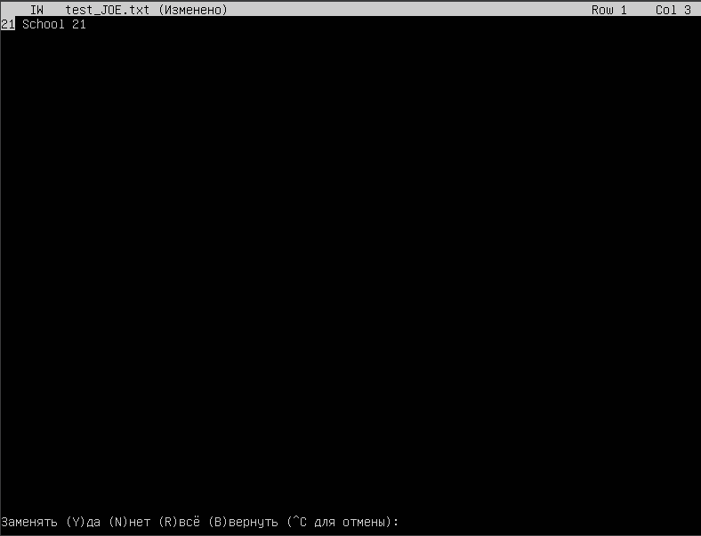
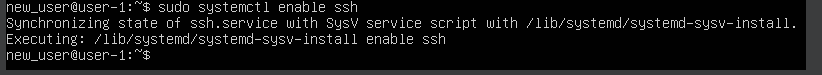
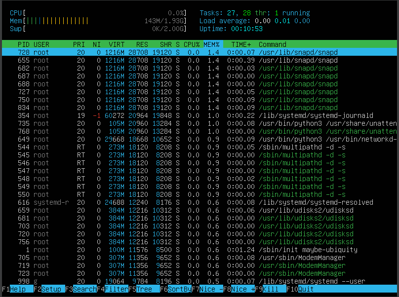

# Отчет по установке Ubuntu 20.04 Server LTS на VirtualBox

## Part 1. Установка ОС
- Скачала образ Ubuntu 20.04 Server LTS с официального сайта.
- Создала новую виртуальную машину в VirtualBox без графического интерфейса.
- Установила Ubuntu 20.04 Server LTS на созданную виртуальную машину.
- После установки, выполнила команду `cat /etc/issue` для проверки версии Ubuntu.

## Part 2. Создание пользователя
- Вызов команды для создания нового пользователя "new_user" в группе adm `sudo adduser --ingroup adm new_user`:

- Вывод команды `cat etc/passwd` для инфо о данных нового пользователя :

## Part 3. Настройка сети ОС
- задаю/меняю название машины на "user-1" `sudo hostnamectl set-hostname user-1`:

- установка временной зоны, соответствубщей текущему положению:
    * устанавливаю временную зону, соответствующую текущему местоположению с помощью команды `sudo timedatectl set-timezone Europe/Moscow`:
    
    * проверка `timedatectl status` :
    

- Для вывода названия сетевых интерфейсов использую `ip link show`

На представленном скрине видно, что в системе есть 2 типа интерфейса. Физический интерфейс enp0s3 — реальный сетевой интерфейс Ethernet для подключения к локальной сети или интернету. Виртуальный интерфейс lo - специяльный виртуальный интерфейс, который используется для обратной связи между процессами на одной машине. Он позволяет программам общаться друг с другом внутри одной системы, как если бы они были разделены сетью.

- Получение IP-адреса от DHCP сервера с помощью команды `ip addr show`:

DHCP — это протокол, который позволяет автоматически назначать IP-адреса и другие сетевые параметры устройствам в сети. Это упрощает управление сетевыми настройками, поскольку администратору не нужно вручную настраивать каждый сетевой интерфейс. Вместо этого, устройства запрашивают конфигурацию у DHCP-сервера при подключении к сети.

- Определение и вывод внешнего IP-адреса шлюза и внутреннего IP-адреса шлюза
    * Внешний IP-адрес шлюза можно определить с помощью команды `curl ifconfig.me`:
    
    * Внутренний IP-адрес шлюза можно получить с помощью команды `ip route | grep default`:
    

- Настраиваю статические(заданные вручную) настройки ip, gw, dns:
    * открываю едактирования файл конфигурации сети Netplan с правами суперпользователя `sudo nano /etc/netplan/00-installer-config.yaml`:
    
    * отключаю DHCP, задаю значения ip, gw, dns:
    

- Перезагружаю виртуальную машину, чтобы убедиться, что статичные сетевые настройки (ip, gw, dns) соответствуют заданным в предыдущем пункте:
    * Вывод данных ip-адреса `ip addr show` и gw `ip route`:
    

- Пинг удаленных хостов `ping 1.1.1.1` и `ping ya.ru`

    * "0% packet loss" означает, что пакеты данных, отправленные с помощью команды `ping`, были успешно доставлены до целевого сервера и обратно, что свидетельствует о хорошем качестве соединения.

## Part 4. Обновление ОС
- Обновляем системные пакеты до последней на момент выполнения задания версии `sudo apt-get upgrade`. Сообщение при попытке повторного обновления пакетов:

## Part 5. Использование команды sudo
- Для того чтобы пользователь мог выполнять команды с привилегиями суперпользователя через sudo, его нужно добавить в группу sudo или в файл sudoers. Это можно сделать с помощью команды usermod `sudo usermod -aG sudo имя_пользователя` bи после этого проверяем, в какой группе группе состоит пользователь и что права ему были переданы `groups new_user`:

        * Истинное назначение команды sudo
Команда sudo (SuperUser DO) позволяет пользователям выполнять команды с привилегиями суперпользователя (root). Это обеспечивает дополнительный уровень безопасности, поскольку не требует постоянного входа в систему под учетной записью суперпользователя, а позволяет временно повышать привилегии для выполнения определенных задач, требующих таких прав.
- для изменения hostname ОС от имени пользователя, созданного в пункте 2[Part 2]:
    * Переходим в учетку new_user `su new_user` и меняем hostname на "newhostname" `sudo hostnamectl set-hostname newhostname`, проверяем название машины с помощью команды `hostname`:
    

## Part 6. Установка и настройка службы времени
- Для включения и запуска службы автоматической синхронизации времени systemd-timesyncd используется следующиая команда `sudo timedatectl set-ntp true`. Для проверки, что автоматическая синхронизация включена выводим команду `timedatectl show` и смотрим на NTPSynchronized=yes:

## Part 7. Установка и использование текстовых редакторов

### Создание текстового файла, редактирование и выход с сохранением измений

#### VIM
- Редактор VIM был предустановлен в ОС
- Создаем файл test_VIM.txt `vim test_VIM.txt`
- Для внесения изменений нажимаем `i` (insert), по завершении ввода нажимаем `ESC`
- Для сохранения изменений и выхода нажимаем `:wq` (write & quit) и `ENTER`:

#### NANO
- Редактор NANO был предустановлен в ОС
- Создаем файл test_NANO.txt `nano test_NANO.txt`
- Вносим текст; для сохранения изменений нажимаем `Ctrl`+`O` и `Enter`; для выхода из редактора далее `Ctrl`+`X`
    

#### JOE
- Для установки JOY необходимо обновить систему `sudo apt update`
- после этого устанавливаем редактор с помощью команды `sudo apt install joe`
- Создаем файл test_JOE.txt `joe test_JOE.txt`
- Вносим текст; для сохранения изменений нажимаем `Ctrl`+`K` и `Enter`; для выхода из редактора далее `X`
    
    

### Редактирование файла и выход без сохранения изменений
#### VIM
- Открываем файл test_VIM.txt `vim test_VIM.txt`
- Нажимаем `i` и заменяем ник на 21 School 21, далее `ESC` 
- Для выхода из редактора без сохранения набираем `:q!` и `Enter`

    

#### NANO
- Открываем файл test_NANO.txt `nano test_NANO.txt`
- Заменяем текст; для выхода из редактора без сохранения изменений нажимаем `Ctrl`+`X` и на вопрос редактора `"Save modified buffer?"` вводим `N`
    

#### JOE
- Открываем файл test_JOE.txt `joe test_JOE.txt`
- Заменяем текcт; для выхода без сохранения нажимаем `Ctrl` + `c` и на вопрос редактора `"Lose changes to this file?"` вводим `y`
    
    

### Поиск по содержимому и замена
#### VIM
- Открываем файл test_VIM.txt `vim test_VIM.txt`
- Вносим изменения в файл (см. выше)
- Для поиска вводим `/<искомое значение>`, в данном случае `/21` и `ENTER`, и система сразу его подсвечивает. Дальнейшее переключение между результатами производится вводом n (следующее значение) и `Shift` + `n` (предыдущее значение). 
Рузультат поиска:

    
- Для замены во всем файле подстроки `"21"` на подстроку `"555"` в командном режиме вводим: `:%s/21/555/g`( %s – выполнить замену во всем файле, g – замена всех совпадений)    
    * Команда для замены всех вхождений:

    * Команда для замены каждого отдельного значения:

#### NANO
- Открываем файл test_NANO.txt `nano test_NANO.txt`

- Для поиска используем команду `Ctrl` + `W`. Внизу экрана появится окно `Search:`, вводим подстроку, которую хотим найти, и `Enter`. Для поиска следующего вхождения данного выражения используется сочетание клавиш `Alt` + `W` (`Option` + `W` для mac). Для поиска предыдущего - `Alt` + `Q` (`Option` + `Q` для mac):

-  Для поиска и замены: `Ctrl` + `\`. Внизу экрана появится окно `Search (to replace)`, вводим подстроку, которую хотим найти и `Enter`. Далее появляется окно `Replace with`, вводим подстроку для замены и `Enter`. Система подсвечивает вхождение и спрашивает `Replace this instatnce?`:
    + Y - yes
    + N - no (при выборе этого варианта переходит к следующему вхождению)
    + A - all (замена всех вхождений)
    + ^С - cancel

#### JOE
- Открываем файл test_JOE.txt `joe test_JOE.txt`
- Заходим в режим поиска и замены: `Ctrl` + `K`, далее `F` (find). Внизу экрана появится окно `Find (^K H for help)`:

- вводим подстроку, которую хотим найти и `Enter`. Появляются варианты: `(I)gnore (R)eplace (B)ackwards Bloc(K) (^K H for help):` 

- - Выбираем `R` (replace)

## Part 8. Установка и базовая настройка сервиса **SSHD**
SSHd (Secure Shell Daemon) – это серверная часть протокола SSH (пакета OpenSSH), которая отвечает за прием и обработку входящих соединений по протоколу SSH. SSH используется для безопасного удаленного доступа к серверам и другим устройствам в сети, обеспечивая шифрование (устанавливает защищенное соединение между клиентом и сервером, шифруя все передаваемые данные) и аутентификацию данных (поддерживает разные методы аутентификации - пароли, ключи SSH, сертификаты и др.).

- установка службы SSH:
    * Обновляем список пакетов `sudo apt update`
    * Устанавливаем пакет OpenSSH Server `sudo apt install openssh-server`
    * Проверяем, что служба работает `sudo systemctl status ssh`:
    

- Добавляем автостарт службы при загрузке системы `sudo systemctl enable ssh`:

- Перенастраиваем службу SSHd на порт 2022:
    * Открываем файл конфигурации SSHd `sudo nano /etc/ssh/sshd_config` 
    * Находим строку `#Port 22`, изменяем её на `Port 2022` (обязательно убираем знак `#`)
    
    * Перезапускаем службу SSHd командой `sudo systemctl restart sshd`

- Используем команду ps, чтобы показать наличие процесса sshd
    + Команда `ps` используется для отображения информации о запущенных процессах. С этой командой используются следующие ключи:
        * `a` – показать процессы всех пользователей, не только текущего
        * `u` – показать процессы с деталями, такими как пользователь, под которым запущен процесс, и используемая память
        * `x` – показать процессы, не привязанные к терминалу 
        * `aux`: эти ключи используются для вывода всех процессов, запущенных всеми пользователями, в пользовательском формате.
    
    + Вводим `ps aux | grep sshd`
    

- Перезагружаем систему `sudo reboot`
- После перезагрузки проверьте, что служба SSHd запущена и слушает порт 2022 `sudo netstat -tan | grep :2022`:

** Если команда netstat отсутствует, установите пакет net-tools `sudo apt-get install net-tools`

- Kоманда `netstat` с ключем `-tan` выводит список всех активных сетевых соединений на компьютере, а также прослушивающих портов и состояний соединений.
Этот ключ включает в себя три отдельных ключа:
  + `-t` – указывает `netstat` отобразить только TCP-соединения
  + `-a` – указывает `netstat` отобразить все соединения и прослушиваемые порты
  + `-n` – указывает `netstat` отобразить числовые значения портов и ip-адресов вместо их символьных имен

- Вывод команды покажет, что служба SSHd слушает на порту 2022. Значение 0.0.0.0:2022 означает, что SSHd принимает соединения на порту 2022 с любого IP-адреса.

## Part 9. Установка и использование утилит **top**, **htop**
Команды `top` и `htop` – инструменты мониторинга производительности – позволяют просматривать информацию о текущем использовании системных ресурсов и запущенных процессах.

###Установка и запуск утилит
Утилита top обычно предустановлена во многих дистрибутивах Linux. используя команду `sudo apt-get update` я обновила пакет:

### Вывод на экран команды `top`

    - uptime: 24 min (время, прошедшее с момента последней загрузки системы)
    - количество авторизованных пользователей: 1 user 
    - общая загрузка системы: 0.00, 0.00, 0.00 (load average – среднее количество процесоов, ожидающих доступа к ЦП в течение последних 1, 5 и 15 минут)
    - общее количество процессов: 95 (Tasks total)
    - загрузка cpu:
        + 0.0 us: 0.0% времени процессора занято пользовательскими процессами
        + 0.0 sy: 0.0% времени процессора занято системными процессами
        + 0.0 ni: 0.0% времени процессора занято процессами с приоритетом ниже нормального
        + 100.0 id: 100% времени процессора простаивает, т.е. не используется
        + 0.0 wa: 0.0% времени процессора ждет ввода-вывода.
        + 0.0 hi: 0.0% времени процессора ждет обработки аппаратных прерываний
        + 0.0 si: 0.0% времени процессора ждет обработки программных прерываний
        + 0.0 st: 0.0% времени процессора занято виртуализацией
    - загрузка памяти (MiB Mem): общий объем оперативной памяти составляет 1971.6 мегабайт, из которых:
        + 1400.2 мегабайт свободны
        + 1237.1 мегабайт используются
        + 595,0 мегабайт используются для буферизации и кэширования
     - pid процесса занимающего больше всего памяти: 658 
    (для сортировки процессов по использованию памяти воспользуемся командой `Shift` + `M`)
    
    - pid процесса, занимающего больше всего процессорного времени: 1439 
    (для сортировки процессов по занимаемому процессорному времени воспользуемся командой `Shift` + `P`)
    
    - для выхода нажимаем `q`

### Вывод команды `htop`
 Для сортировки после ввода команды `htop` нажимаем `F6` и переключаемся по элементам для выбора, затем `ENTER`)
    * отсортированный по `PID`:
    

    * отсортированный по `PERCENT_CPU`:

    + отсортированный по `PERCENT_MEM`:

    + отсортированный по `TIME`:

    Для фильтра нажимаем `F4`, вводим `sshd` + `ENTER`
    + отфильтрованный для процесса `sshd`:

    Чтобы вывести `htop` с процессом `syslog` нажимаем `F3` для отображения строки поиска и вводим `syslog` + `ENTER`, система найдет и выделит процесс (если такой процесс запущен в системе); `syslog` собирает сообщения от различных компонентов системы (ошибки, предупреждения, информационные сообщения и отладочную информацию) и записывает их в лог-файлы 
    + с процессом syslog:

    Чтобы вывести `htop` с добавленными полями `hostname`, `clock` и `uptime` нажимаем `F2` для отображения меню конфигурации; переходим в раздел `Setup`, выбираем подраздел `Meters`, перемещаемся стрелками направо в `Available meters`, выбираем нужный, нажимаем `ENTER`, перемещаем стрелками влево или вправо, чтобы разместить в левой или правой колонке (на скриншоте они расположены в левой колонке), для удаления используем `Delete`, для выхода – `F10` 
    + с добавленным выводом hostname, clock и uptime:

# Part 10. Использование утилиты **fdisk**
Утилита `fdisk` позволяет создавать, изменять, удалять и просматривать разделы на дисках

- Запускаем команду `fdisk -l`

    + Название жесткого диска:  /dev/sda
    + Размер жесткого диска: 25 ГБ
    + Количество секторов: 52428800
    + swap-раздел (используется для хранения данных, которые не умещаются в оперативной памяти) файл подкачки /swapfile размером 2 ГБ в данный момент не используется (USED равно 0B):
    

## Part 11. Использование утилиты **df**
Утилита `df` (disk free) используется для вывода инфо о доступном месте на файловых системах – размер файловой системы, использованное пространство и т.д.
- Вывод команды `df`

    + Размер раздела: 11758760 килобайт
    + Размер занятого пространства: 5350872 килобайт
    + Размер свободного пространства: 5788780 килобайт
    + Использовано 49%
- Вывод команды `df -Th`

    + Размер раздела: 12 Гб
    + Размер занятого пространства: 5.2 Гб
    + Размер свободного пространства: 5.6 Гб
    + Использовано 49%

## Part 12. Использование утилиты **du**
Утилита `du` (disk usage) предназначена для оценки использования дискового пространства файлами и директориями
- Вывод команды `du`
    
    

- Вывод размера папок /home, /var, /var/log (в байтах, в человекочитаемом виде):

Вводим команды для каждой директории
`du -hs --bytes /home`
`du -hs --bytes /var`
`du -hs --bytes /var/log`
    * -h выводит в человекочитаемом формате
    * -s выводит только суммарный размер каждой указанной директории
    * --bytes выводит размер в байтах

- Вывод размера каждого вложенного элемента в /var/log: `du -h /var/log/*` (убираем `--bytes`, но оставляем человекочитаемый формат, в итоге размер указан в килобайтах):

## Part 13. Установка и использование утилиты **ncdu**
`ncdu` – это интерактивная командная утилита для анализа использования дискового пространства (позволяет быстро и удобно исследовать структуру каталогов и файлов на диске, оценить размер каждого элемента и удалить ненужные файлы прямо из интерфейса)

- Для установки утилиты используем команду `sudo apt install ncdu`
    + Вывод утилиты `ncdu` для каталога `/home`:
    
    + Вывод утилиты `ncdu` для каталога `/var`:
    
    + Вывод утилиты `ncdu` для каталога `/var/log`:
    
    + Так как в [Part 12](#Part-12-использование-утилиты-du) по заданию мы вычисляли размеры каталогов в байтах, на скрине ниже представлены размеры в K(KiB) и M(MiB) для сравнения с данными выше
    

## Part 14. Работа с системными журналами
- Для открытия файлов для просмотра используем команду `cat`
- при выводе команды `/var/log/auth.log` видно 
* время последней успешной авторизации '21:08:42'
* имя пользователя user broderci
* uid = 0 показывает, что пользователь имеет права суперпользователя и вход был осуществлен при помощи логина

- Перезапускаем службу `sshd` `sudo systemctl restart ssh`

- Часть файла `var/log/syslog` с сообщениями о перезапуске службы SSHd:

## Part 15. Использование планировщика заданий **CRON**
`CRON` - это системный планировщик задач, который позволяет выполнять заданные команды или скрипты автоматически в заданное время или с интервалом

- для создания нового файла расписания CRON, который будет запускать команду uptimeкаждые две минуты используем команду `crontab -e`. После этого в открывшемся редакторе пишем строку `*/2 * * * * uptime 
Эта строка означает, что команда uptime будет выполняться каждые 2 минуты в любое время и день недели

- еще раз запускаем команду `var/log/syslog` для просмотра выволнения команды `uptime`:

- для вывода списка текущих заданий для CRON `crontab -l`:
    

- для удаления всех заданий из планировщика заданий `crontab -r` и вывода списка текущих задач :
